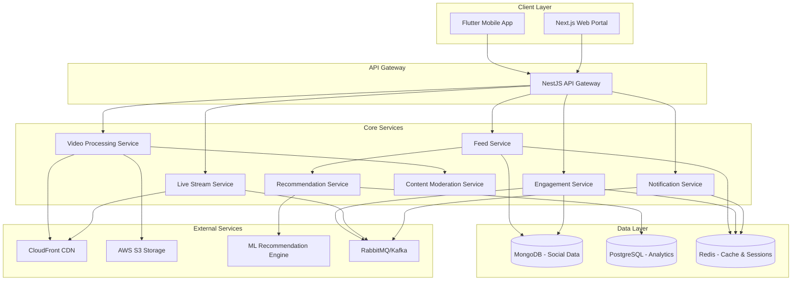

# Design Document: Social Media Engine

## Overview

The Social Media Engine is a high-performance, scalable system designed to deliver TikTok-style video experiences with real-time interactions and AI-powered content recommendations. The system handles millions of concurrent users, processes video content at scale, and provides sub-50ms recommendation responses.

Key design principles:
- **Microservices Architecture**: Independent, scalable services for different concerns
- **Event-Driven Design**: Real-time updates and notifications through message queues
- **Polyglot Persistence**: Optimized databases for different data patterns
- **CDN-First Video Delivery**: Global, low-latency video streaming
- **AI-Powered Recommendations**: Machine learning for personalized content discovery

## Architecture



## Components and Interfaces

### 1. API Gateway (NestJS)

**Responsibilities:**
- Request routing and load balancing
- Authentication and authorization
- Rate limiting and throttling
- Request/response transformation
- API versioning

**Key Interfaces:**
```typescript
interface APIGateway {
  routeRequest(request: HttpRequest): Promise<HttpResponse>
  authenticateUser(token: string): Promise<User>
  enforceRateLimit(userId: string, endpoint: string): Promise<boolean>
}
```

### 2. Feed Service

**Responsibilities:**
- Personalized feed generation
- Content ranking and filtering
- Feed caching and optimization
- User timeline management

**Key Interfaces:**
```typescript
interface FeedService {
  generateFeed(userId: string, page: number): Promise<VideoFeed>
  refreshFeed(userId: string): Promise<void>
  recordFeedInteraction(userId: string, videoId: string, action: string): Promise<void>
}

interface VideoFeed {
  videos: Video[]
  nextPageToken: string
  totalCount: number
}
```

### 3. Video Processing Service

**Responsibilities:**
- Video upload and validation
- Multi-resolution transcoding
- Thumbnail generation
- Content moderation integration
- CDN distribution

**Key Interfaces:**
```typescript
interface VideoService {
  uploadVideo(file: VideoFile, metadata: VideoMetadata): Promise<Video>
  transcodeVideo(videoId: string): Promise<TranscodingJob>
  generateThumbnail(videoId: string): Promise<string>
  distributeToCDN(videoId: string): Promise<CDNUrls>
}

interface Video {
  id: string
  creatorId: string
  title: string
  description: string
  hashtags: string[]
  urls: CDNUrls
  duration: number
  createdAt: Date
}
```

### 4. Engagement Service

**Responsibilities:**
- Like/unlike operations
- Comment management
- Share tracking
- Follow/unfollow operations
- Real-time engagement updates

**Key Interfaces:**
```typescript
interface EngagementService {
  likeVideo(userId: string, videoId: string): Promise<EngagementResult>
  addComment(userId: string, videoId: string, comment: string): Promise<Comment>
  followUser(followerId: string, followeeId: string): Promise<FollowResult>
  getEngagementStats(videoId: string): Promise<EngagementStats>
}

interface EngagementStats {
  likes: number
  comments: number
  shares: number
  views: number
}
```

### 5. Recommendation Service

**Responsibilities:**
- User behavior analysis
- Content similarity computation
- Personalized recommendations
- Trending content identification
- A/B testing for recommendation algorithms

**Key Interfaces:**
```typescript
interface RecommendationService {
  getRecommendations(userId: string, count: number): Promise<Video[]>
  recordUserInteraction(userId: string, videoId: string, interaction: Interaction): Promise<void>
  updateUserProfile(userId: string, preferences: UserPreferences): Promise<void>
  getTrendingContent(category?: string): Promise<Video[]>
}

interface Interaction {
  type: 'view' | 'like' | 'share' | 'skip'
  duration: number
  timestamp: Date
}
```

### 6. Live Stream Service

**Responsibilities:**
- Live broadcast initiation
- Real-time video streaming
- Live chat management
- Stream quality adaptation
- Recording and archival

**Key Interfaces:**
```typescript
interface StreamService {
  startLiveStream(creatorId: string, metadata: StreamMetadata): Promise<LiveStream>
  joinStream(userId: string, streamId: string): Promise<StreamConnection>
  sendLiveMessage(userId: string, streamId: string, message: string): Promise<void>
  endStream(streamId: string): Promise<StreamArchive>
}

interface LiveStream {
  id: string
  creatorId: string
  title: string
  streamUrl: string
  chatRoomId: string
  viewerCount: number
  startedAt: Date
}
```

### 7. Notification Service

**Responsibilities:**
- Push notification delivery
- In-app notification management
- Notification preferences
- Real-time notification streaming
- Notification analytics

**Key Interfaces:**
```typescript
interface NotificationService {
  sendPushNotification(userId: string, notification: Notification): Promise<void>
  getNotifications(userId: string, page: number): Promise<NotificationList>
  markAsRead(userId: string, notificationId: string): Promise<void>
  updatePreferences(userId: string, preferences: NotificationPreferences): Promise<void>
}

interface Notification {
  id: string
  type: 'like' | 'comment' | 'follow' | 'upload'
  title: string
  body: string
  data: Record<string, any>
  createdAt: Date
}
```

## Data Models

### MongoDB Collections

**Videos Collection:**
```typescript
interface VideoDocument {
  _id: ObjectId
  creatorId: ObjectId
  title: string
  description: string
  hashtags: string[]
  urls: {
    original: string
    hd: string
    sd: string
    thumbnail: string
  }
  duration: number
  metadata: {
    resolution: string
    fileSize: number
    codec: string
  }
  stats: {
    views: number
    likes: number
    comments: number
    shares: number
  }
  moderationStatus: 'pending' | 'approved' | 'rejected'
  createdAt: Date
  updatedAt: Date
}
```

**Users Collection:**
```typescript
interface UserDocument {
  _id: ObjectId
  username: string
  email: string
  profile: {
    displayName: string
    bio: string
    avatar: string
    verified: boolean
  }
  stats: {
    followers: number
    following: number
    videos: number
    totalLikes: number
  }
  preferences: {
    privacy: 'public' | 'private'
    notifications: NotificationPreferences
    contentCategories: string[]
  }
  createdAt: Date
  updatedAt: Date
}
```

**Engagements Collection:**
```typescript
interface EngagementDocument {
  _id: ObjectId
  userId: ObjectId
  videoId: ObjectId
  type: 'like' | 'comment' | 'share' | 'view'
  data?: {
    comment?: string
    watchDuration?: number
    platform?: string
  }
  createdAt: Date
}
```

### PostgreSQL Tables

**User Interactions (Analytics):**
```sql
CREATE TABLE user_interactions (
  id SERIAL PRIMARY KEY,
  user_id VARCHAR(24) NOT NULL,
  video_id VARCHAR(24) NOT NULL,
  interaction_type VARCHAR(20) NOT NULL,
  duration_seconds INTEGER,
  device_type VARCHAR(20),
  location VARCHAR(100),
  timestamp TIMESTAMP WITH TIME ZONE DEFAULT NOW(),
  session_id VARCHAR(50)
);

CREATE INDEX idx_user_interactions_user_time ON user_interactions(user_id, timestamp);
CREATE INDEX idx_user_interactions_video_time ON user_interactions(video_id, timestamp);
```

**Content Performance:**
```sql
CREATE TABLE content_performance (
  video_id VARCHAR(24) PRIMARY KEY,
  total_views BIGINT DEFAULT 0,
  unique_views BIGINT DEFAULT 0,
  avg_watch_duration DECIMAL(5,2),
  engagement_rate DECIMAL(5,4),
  viral_score DECIMAL(8,4),
  last_updated TIMESTAMP WITH TIME ZONE DEFAULT NOW()
);
```

### Redis Data Structures

**Feed Cache:**
```typescript
// Key: feed:{userId}:{page}
// Value: JSON array of video IDs with metadata
interface CachedFeed {
  videos: string[]
  generatedAt: number
  ttl: number
}
```

**Trending Content:**
```typescript
// Key: trending:{category}:{timeframe}
// Value: Sorted set with scores
// ZADD trending:all:1h {score} {videoId}
```

**User Sessions:**
```typescript
// Key: session:{sessionId}
// Value: Hash with user data
interface UserSession {
  userId: string
  deviceId: string
  lastActivity: number
  preferences: Record<string, any>
}
```

## Correctness Properties

*A property is a characteristic or behavior that should hold true across all valid executions of a system-essentially, a formal statement about what the system should do. Properties serve as the bridge between human-readable specifications and machine-verifiable correctness guarantees.*

### Property 1: Feed Response Time
*For any* user opening the app, the personalized video feed should be displayed within 2 seconds regardless of user profile complexity or network conditions
**Validates: Requirements 1.1**

### Property 2: Video Auto-Play Behavior
*For any* video entering the viewport, the video should automatically start playing without requiring user interaction
**Validates: Requirements 1.3**

### Property 3: Single Video Playback
*For any* user navigation between videos, only one video should be playing at any given time, with the previous video paused when a new one starts
**Validates: Requirements 1.4**

### Property 4: Infinite Scroll Continuity
*For any* feed reaching the bottom, new content should load without interrupting the currently playing video
**Validates: Requirements 1.5**

### Property 5: Video Control Toggle
*For any* video tap interaction, the video player should toggle between play and pause states consistently
**Validates: Requirements 2.1**

### Property 6: Double-Tap Like Registration
*For any* double-tap gesture on the right side of a video, the engagement engine should register exactly one like and display the heart animation
**Validates: Requirements 2.2**

### Property 7: Swipe Navigation
*For any* left or right swipe gesture, the feed should navigate to the adjacent video in the sequence
**Validates: Requirements 2.3**

### Property 8: Adaptive Video Quality
*For any* video playback under varying network conditions, the video quality should adjust to maintain smooth playback without buffering
**Validates: Requirements 2.4**

### Property 9: Video Looping
*For any* video reaching its end, the content should automatically restart from the beginning
**Validates: Requirements 2.5**

### Property 10: Like Count Consistency
*For any* like button interaction, the like count should increment by exactly one and the UI should reflect the change immediately
**Validates: Requirements 3.1**

### Property 11: Comment Interface Loading
*For any* comment button tap, the comment interface should open and display all existing comments for that video
**Validates: Requirements 3.2**

### Property 12: Comment Creation and Notification
*For any* comment submission, the comment should be saved to the video and a notification should be sent to the content creator
**Validates: Requirements 3.3**

### Property 13: Follow Relationship Creation
*For any* follow action, the creator should be added to the user's following list and this should influence future recommendations
**Validates: Requirements 3.5**

### Property 14: Engagement Signal Recording
*For any* video watched for more than 3 seconds, an engagement signal should be recorded in the recommendation system
**Validates: Requirements 4.1**

### Property 15: Positive Feedback Amplification
*For any* liked or shared content, similar content should appear more frequently in future recommendations
**Validates: Requirements 4.2**

### Property 16: Negative Feedback Reduction
*For any* quickly skipped content, similar content should appear less frequently in future recommendations
**Validates: Requirements 4.3**

### Property 17: Recommendation Diversity
*For any* generated recommendation set, the content should include diverse factors: user behavior, trending content, and creator variety
**Validates: Requirements 4.4**

### Property 18: Search Result Ranking
*For any* search query, results should be ranked by relevance, engagement metrics, and recency
**Validates: Requirements 4.5**

### Property 19: File Validation
*For any* video file upload, invalid formats or files exceeding duration limits should be rejected while valid files should be accepted
**Validates: Requirements 5.1**

### Property 20: Video Transcoding
*For any* uploaded video, the system should generate multiple quality levels (HD, SD, mobile) for adaptive streaming
**Validates: Requirements 5.2**

### Property 21: Metadata Persistence
*For any* video with added metadata (title, description, hashtags), all metadata should be stored and retrievable with the video
**Validates: Requirements 5.3**

### Property 22: Content Moderation Workflow
*For any* uploaded content, the content should pass through moderation scanning before being published to feeds
**Validates: Requirements 5.4**

### Property 23: Content Publication
*For any* content passing moderation, the video should become discoverable in the feed system
**Validates: Requirements 5.5**

### Property 24: Live Stream Initiation
*For any* live stream start request, a broadcast session should be initiated within 5 seconds
**Validates: Requirements 6.1**

### Property 25: Stream Latency
*For any* viewer joining a live stream, the video feed should be delivered with less than 3 seconds latency
**Validates: Requirements 6.2**

### Property 26: Real-Time Chat
*For any* live comment sent during a stream, the comment should appear in real-time for all stream participants
**Validates: Requirements 6.3**

### Property 27: Stream Archival
*For any* ended live stream, the system should provide the option to save the broadcast as a regular video
**Validates: Requirements 6.4**

### Property 28: Stream Quality Adaptation
*For any* live stream experiencing network degradation, the stream quality should adjust to maintain connection
**Validates: Requirements 6.5**

### Property 29: Notification Timing
*For any* content interaction (like, comment, follow), the affected user should receive a push notification within 30 seconds
**Validates: Requirements 7.1, 7.2, 7.3**

### Property 30: Immediate Message Notifications
*For any* direct message sent, the recipient should receive a notification immediately
**Validates: Requirements 7.4**

### Property 31: Notification Preferences
*For any* notification delivery, the system should respect the user's notification preference settings
**Validates: Requirements 7.5**

### Property 32: Content Moderation Detection
*For any* uploaded content containing inappropriate visual or audio material, the content should be flagged by AI detection systems
**Validates: Requirements 8.1, 8.2**

### Property 33: Policy Violation Handling
*For any* content violating platform policies, publication should be prevented and the creator should be notified
**Validates: Requirements 8.3**

### Property 34: User Report Processing
*For any* user-reported content, the content should be queued for human review
**Validates: Requirements 8.4**

### Property 35: Content Removal Process
*For any* removed content, affected users should be notified and provided with appeal options
**Validates: Requirements 8.5**

### Property 36: High Load Performance
*For any* system state with over 10,000 concurrent users, feed response times should remain under 2 seconds
**Validates: Requirements 9.1**

### Property 37: CDN Utilization
*For any* video traffic spike, the CDN should serve content to reduce server load
**Validates: Requirements 9.2**

### Property 38: Cache Utilization
*For any* increased database query load, Redis caching should be used for frequently accessed data
**Validates: Requirements 9.3**

### Property 39: Graceful Degradation
*For any* system resource constraints, the recommendation system should fall back to simpler algorithms
**Validates: Requirements 9.4**

### Property 40: Error Resilience
*For any* system error, incidents should be logged and cached content should continue to be served
**Validates: Requirements 9.5**

### Property 41: Interaction Tracking
*For any* content interaction (view, like, comment, share), the interaction should be tracked in analytics
**Validates: Requirements 10.1**

### Property 42: Analytics Reporting
*For any* analytics request, engagement metrics should be provided for the specified time period
**Validates: Requirements 10.2**

### Property 43: Demographic Analytics
*For any* analytics display, audience demographics and peak viewing times should be included
**Validates: Requirements 10.3**

### Property 44: Viral Pattern Detection
*For any* trending content, viral growth patterns and reach metrics should be highlighted
**Validates: Requirements 10.4**

### Property 45: Content Improvement Recommendations
*For any* creator accessing insights, actionable recommendations for content improvement should be provided
**Validates: Requirements 10.5**

## Error Handling

### Error Categories

**1. Network Errors**
- Connection timeouts during video streaming
- CDN failures and fallback mechanisms
- API gateway failures and circuit breaker patterns

**2. Data Consistency Errors**
- Like count synchronization across distributed systems
- Comment ordering in high-concurrency scenarios
- Feed consistency during cache invalidation

**3. Content Processing Errors**
- Video transcoding failures
- Thumbnail generation errors
- Content moderation API failures

**4. Performance Degradation**
- High latency during peak traffic
- Memory pressure in recommendation algorithms
- Database connection pool exhaustion

### Error Handling Strategies

**Circuit Breaker Pattern:**
```typescript
interface CircuitBreaker {
  execute<T>(operation: () => Promise<T>): Promise<T>
  getState(): 'CLOSED' | 'OPEN' | 'HALF_OPEN'
  onFailure(error: Error): void
  onSuccess(): void
}
```

**Graceful Degradation:**
- Serve cached content when real-time recommendations fail
- Use simplified algorithms when ML services are unavailable
- Display static thumbnails when dynamic generation fails

**Retry Mechanisms:**
- Exponential backoff for transient failures
- Dead letter queues for persistent failures
- Manual retry options for user-initiated actions

## Testing Strategy

### Dual Testing Approach

The testing strategy employs both **unit tests** and **property-based tests** to ensure comprehensive coverage:

**Unit Tests:**
- Verify specific examples and edge cases
- Test integration points between microservices
- Validate error conditions and boundary cases
- Focus on concrete scenarios and known failure modes

**Property-Based Tests:**
- Verify universal properties across all inputs
- Test system behavior with randomized data
- Ensure correctness properties hold under various conditions
- Provide comprehensive input coverage through randomization

### Property-Based Testing Configuration

**Framework:** fast-check (JavaScript/TypeScript)
**Minimum Iterations:** 100 per property test
**Test Tagging:** Each property test must reference its design document property

**Example Property Test Structure:**
```typescript
// Feature: social-media-engine, Property 1: Feed Response Time
describe('Feed Response Time Property', () => {
  it('should display personalized feed within 2 seconds for any user', async () => {
    await fc.assert(fc.asyncProperty(
      fc.record({
        userId: fc.string(),
        networkCondition: fc.oneof(fc.constant('fast'), fc.constant('slow')),
        profileComplexity: fc.integer(1, 100)
      }),
      async (testData) => {
        const startTime = Date.now()
        const feed = await feedService.generateFeed(testData.userId, 1)
        const responseTime = Date.now() - startTime
        
        expect(responseTime).toBeLessThan(2000)
        expect(feed.videos).toBeDefined()
        expect(feed.videos.length).toBeGreaterThan(0)
      }
    ), { numRuns: 100 })
  })
})
```

### Testing Infrastructure

**Test Environment:**
- Dockerized microservices for integration testing
- Mock CDN and external services
- Redis and MongoDB test instances
- Load testing with Artillery or k6

**Continuous Testing:**
- Property tests run on every commit
- Performance regression testing
- Load testing in staging environment
- A/B testing for recommendation algorithms

**Monitoring and Observability:**
- Real-time performance metrics
- Error rate monitoring
- User engagement analytics
- System health dashboards